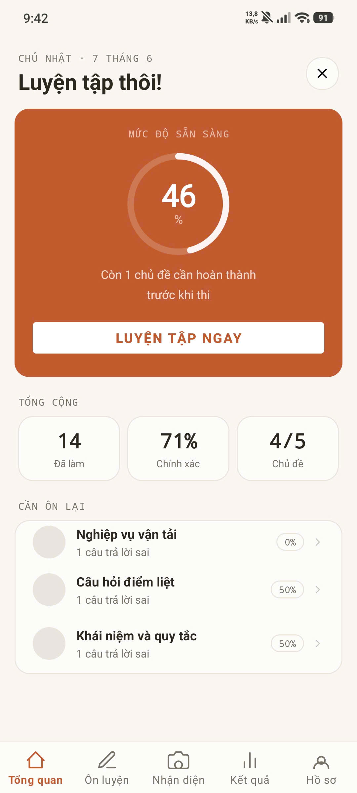
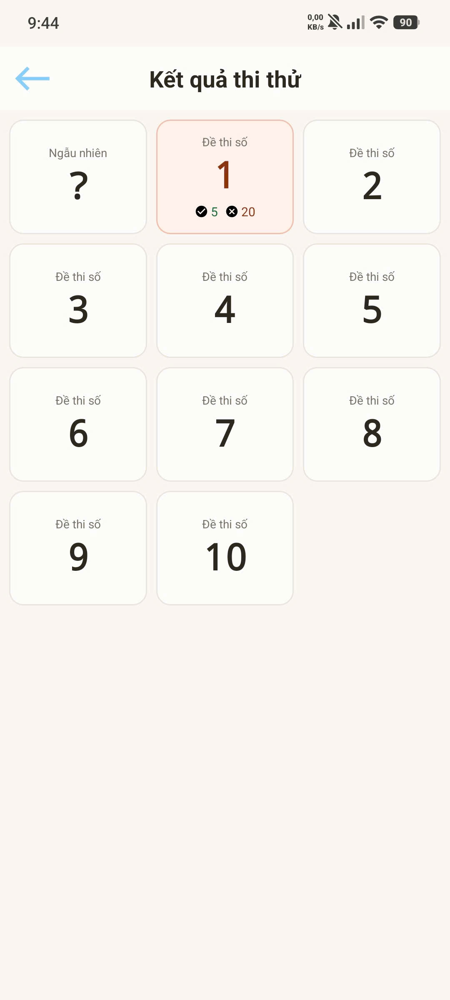
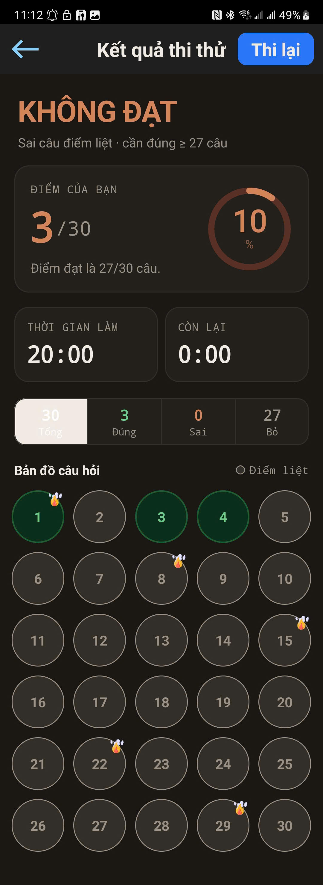

# APP ÔN THI BẰNG LÁI XE

Language: Java

Database: SQLite,Firebase 

>**Môn học: Lập trình mobile cơ bản**

Giảng viên hướng dẫn:

<ul>
  <li>TS.Lê Anh Tiến</li>
</ul>

Member:
 
<ul>
  <li>Ngô Thanh Tùng</li>
  <li>Tô Quốc Tuấn</li>
  <li>Lê Xuân Trường </li>
</ul>

> **App có tích hợp 1 services của google**

- google.firebase.MESSAGING_EVENT

### Mục lục

[I. Mở đầu](#Modau)

[II. Giao diện](#GiaoDien)

- [2.1	Main](#Main)
- [2.2	Biển báo](#BienBao)
- [2.3	Mẹo ôn thi](#MeoOnThi)
- [2.4	Sa hình](#SaHinh)
- [2.6	Thi thử (Đề thi)](#ThiThu)
- [2.7	Kết quả](#KetQua)
- [2.8	Thi thử](#ThiThu)
- [2.9	Câu hỏi ôn tập theo chủ đề](#CauHoiTheoChuDe)

[III. Tổng kết](#TongKet)

## I. Mở đầu
- Tên phần mềm: `Ôn thi bằng lái xe`
- Ứng dụng:
    - Giống như tên gọi, ứng dụng hỗ trợ người dùng ôn thi lái xe qua việc thi theo các đề thi và đọc lý thuyết. Việc bổ sung, thêm sửa xóa, tạo mới các câu hỏi, cập nhập lí thuyết sẽ do các admin quản lí thông qua cập nhập firebase. 

## II. Giao diện

### 2.1 Main

### 2.2 Biển báo

### 2.3 Mẹo ôn thi

### 2.4 Sa hình
  

### 2.6 Thi thử (Đề thi)

### 2.7 kết quả

### 2.8 Thi thử

### 2.9 Câu hỏi ôn tập theo chủ đề

## III. Tổng kết

- Tự đánh giá việc triển khai bài tập nhóm, tự nhận xét kết quả đạt được:

  - Nhóm đã hoàn thành được hầu hết mọi tính năng chính đã đặt ra từ đầu và bổ sung thêm các tính năng mới.

  - Thành viên trong nhóm khá hài lòng với sản phẩm của nhóm xây dựng (mặc dù còn một số phần chưa hài lòng VD: tốc độ load bị ảnh hưởng do ảnh, giao diện hơi đơn giản, còn lỗi khi chạy ...).

- Nêu bài học kinh nghiệm rút ra từ bài tập dự án của nhóm:

  - Học được về lập trình android Java biết thêm về nhưng thư viện hay.
  - Học được thêm về làm việc theo nhóm, sử dụng các công cụ hỗ trợ (GitHub, AI...) để hoàn thành 1 dự án.