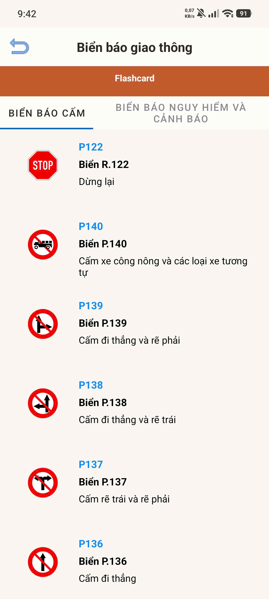
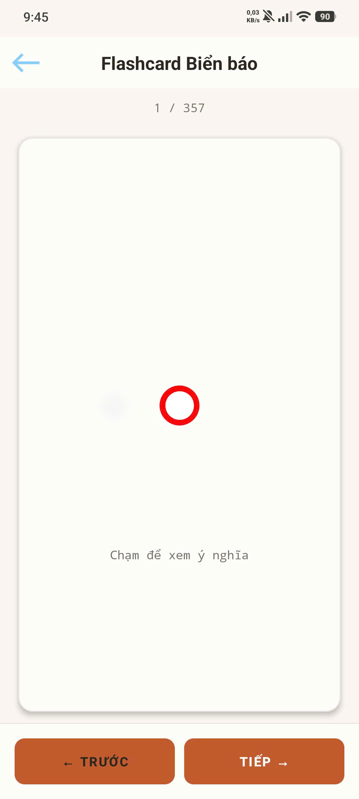
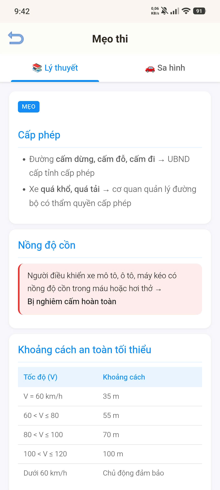
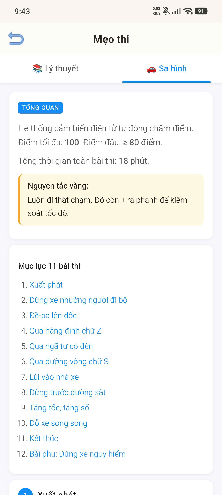
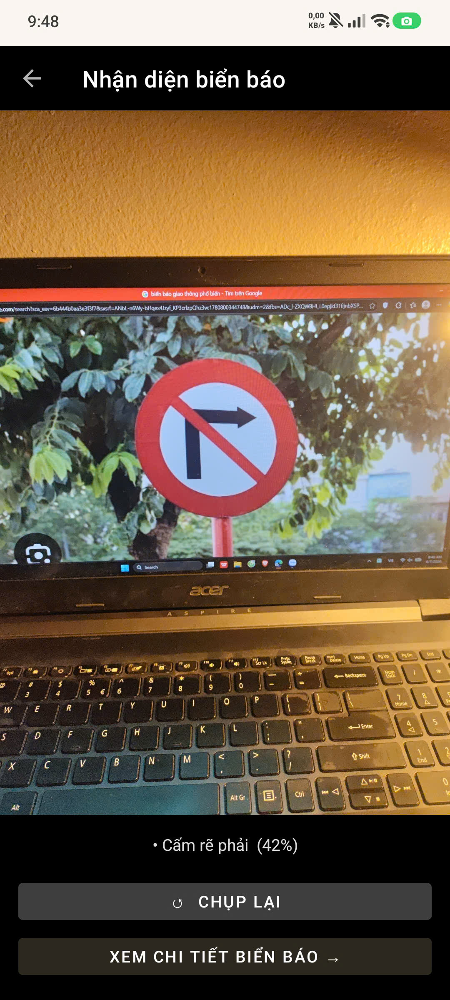
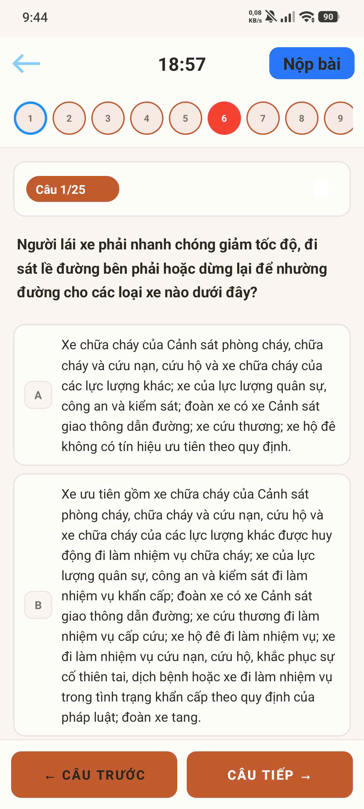
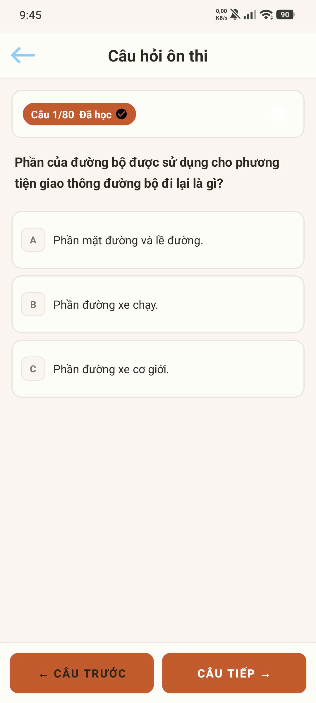
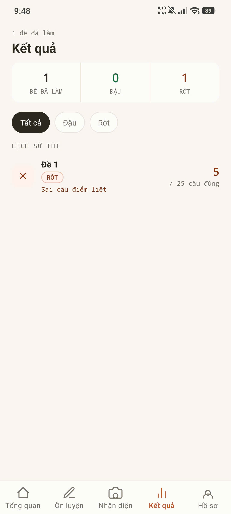

# APP ÔN THI BẰNG LÁI XE

Language: Java

Database: SQLite,Firebase 

>**Môn học: Lập trình mobile cơ bản**

Giảng viên hướng dẫn:

<ul>
  <li>TS.Lê Anh Tiến</li>
</ul>

Member:
 
<ul>
  <li>Ngô Thanh Tùng</li>
  <li>Tô Quốc Tuấn</li>
  <li>Lê Xuân Trường </li>
</ul>

> **App có tích hợp 1 services của google**

- google.firebase.MESSAGING_EVENT

### Mục lục

[I. Mở đầu](#Modau)

[II. Giao diện](#GiaoDien)

- [2.1	Main](#Main)
- [2.2	Biển báo](#BienBao)
- [2.3	Mẹo ôn thi](#MeoOnThi)
- [2.4	Sa hình](#SaHinh)
- [2.5	Nhận diện biển báo (YOLOv8)](#NhanDien)
- [2.6	Thi thử (Đề thi)](#DanhSachDeThi)
- [2.7	Kết quả chi tiết](#KetQua)
- [2.8	Thi thử (Làm bài)](#LamBaiThi)
- [2.9	Câu hỏi ôn tập theo chủ đề](#CauHoiTheoChuDe)
- [2.10	Lịch sử thi](#LichSuThi)

[III. Tổng kết](#TongKet)

## I. Mở đầu
- Tên phần mềm: `Ôn thi bằng lái xe`
- Ứng dụng:
    - Giống như tên gọi, ứng dụng hỗ trợ người dùng ôn thi lái xe qua việc thi theo các đề thi và đọc lý thuyết. Việc bổ sung, thêm sửa xóa, tạo mới các câu hỏi, cập nhập lí thuyết sẽ do các admin quản lí thông qua cập nhập firebase. 

## II. Giao diện

### 2.1 Main (Tổng quan)
- Màn hình chính hiển thị tiến độ ôn tập, mức độ sẵn sàng đi thi và gợi ý các chủ đề cần ôn luyện lại.

### 2.2 Biển báo
- Danh sách hệ thống các biển báo giao thông đường bộ (biển báo cấm, biển báo nguy hiểm...). Tích hợp tính năng học qua Flashcard để ghi nhớ nhanh chóng.

### 2.3 Mẹo ôn thi
- Tổng hợp các mẹo thi lý thuyết luật giao thông đường bộ hữu ích.

### 2.4 Sa hình
- Hướng dẫn các bước và mẹo làm 11 bài thi sa hình thực hành.

### 2.5 Nhận diện biển báo (YOLOv8)
- Tính năng chụp ảnh hoặc sử dụng camera để tự động nhận diện và tra cứu thông tin biển báo giao thông sử dụng mô hình học máy YOLOv8.

### 2.6 Thi thử (Đề thi)
- Danh sách các bộ đề thi thử được biên soạn theo cấu trúc chuẩn.

### 2.7 Kết quả chi tiết
- Xem chi tiết kết quả bài thi thử, số lượng câu đúng/sai và bản đồ các câu hỏi đã làm (đặc biệt lưu ý các câu hỏi điểm liệt).

### 2.8 Thi thử (Làm bài)
- Giao diện làm bài thi trắc nghiệm trực quan với thời gian đếm ngược.

### 2.9 Câu hỏi ôn tập theo chủ đề
- Học lý thuyết và ôn tập câu hỏi được phân loại theo từng chủ đề cụ thể (như luật giao thông, kỹ thuật lái xe, đạo đức...).

### 2.10 Lịch sử thi
- Lưu giữ và thống kê kết quả của các lần thi thử trước đó để theo dõi sự tiến bộ.

## III. Tổng kết

- Tự đánh giá việc triển khai bài tập nhóm, tự nhận xét kết quả đạt được:

  - Nhóm đã hoàn thành được hầu hết mọi tính năng chính đã đặt ra từ đầu và bổ sung thêm các tính năng mới.

  - Thành viên trong nhóm khá hài lòng với sản phẩm của nhóm xây dựng (mặc dù còn một số phần chưa hài lòng VD: tốc độ load bị ảnh hưởng do ảnh, giao diện hơi đơn giản, còn lỗi khi chạy ...).

- Nêu bài học kinh nghiệm rút ra từ bài tập dự án của nhóm:

  - Học được về lập trình android Java biết thêm về nhưng thư viện hay.
  - Học được thêm về làm việc theo nhóm, sử dụng các công cụ hỗ trợ (GitHub, AI...) để hoàn thành 1 dự án.